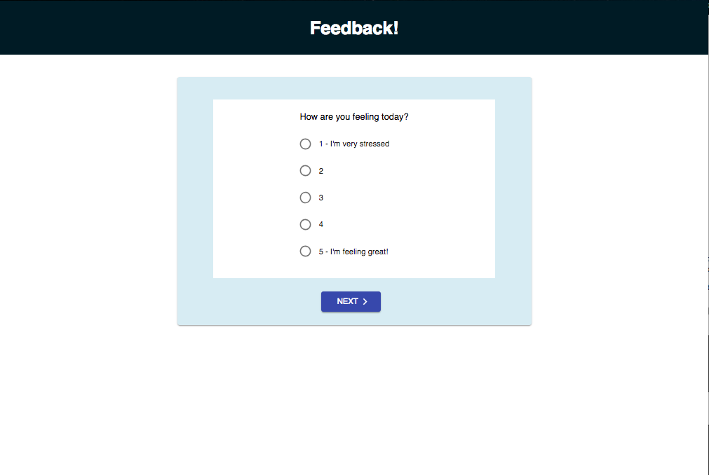
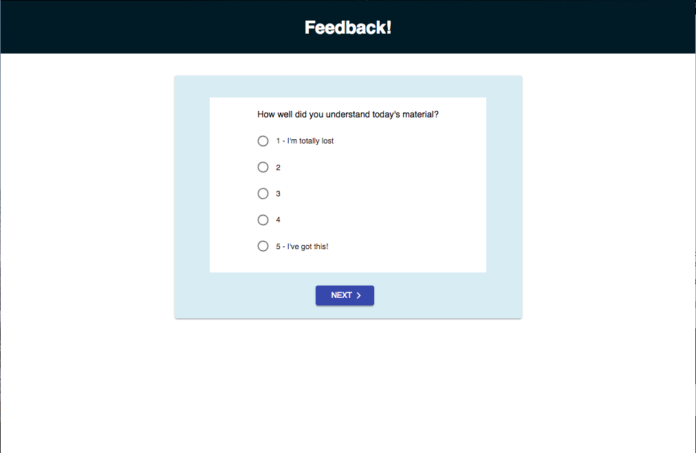
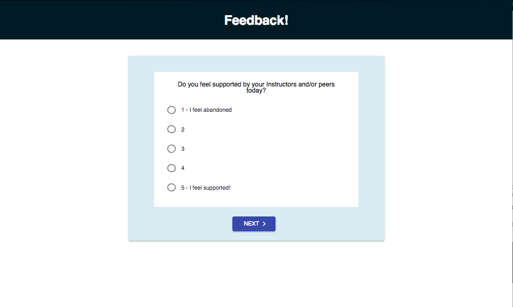
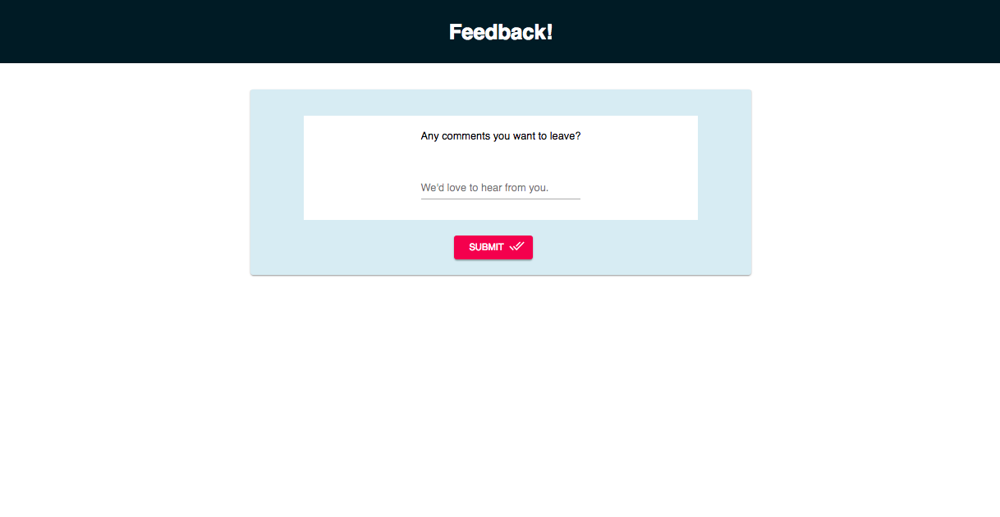
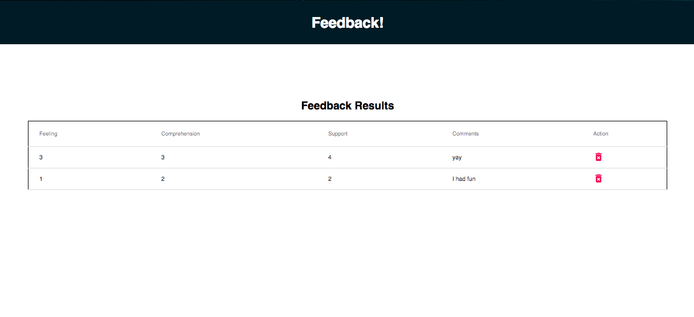

# Redux Feedback Loop

This web application has a multi-part form that allows users to leave daily feedback. There are 4 views for the form parts.

The parts:

- How are you feeling today?

- How well are you understanding the content?

- How well are you being supported?

- Any comments you want to leave?

### DISPLAY FEEDBACK

Display all of the existing feedback at the route `/admin`. The most recently added feedback should appear at the top of the list. Allow the user to delete existing feedback. Prompt the user to confirm prior to deleting the feedback from the database.

